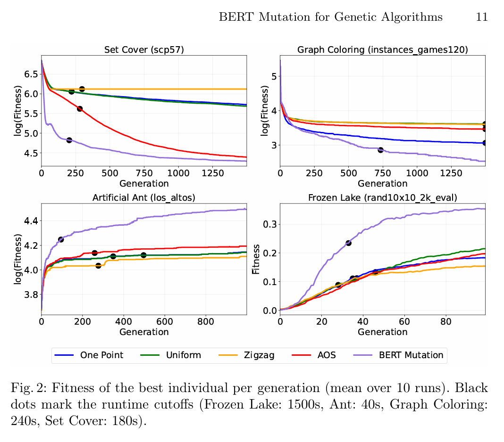

## About the paper

This repository implements the paper `BERT Mutation: Deep Transformer Model for Masked Uniform Mutation in Genetic Algorithms`.

The paper proposes a domain-independent mutation operator for genetic algorithms that uses a BERT-style masked model to predict beneficial gene replacements from context. To make this work for fixed-length GA representations, it adds an elite-guided data augmentation mechanism that creates additional learning signal from strong historical solutions.

In the paper, the method is evaluated on four domains: Frozen Lake, Artificial Ant, Graph Coloring, and Unweighted Set Cover. The reported results show faster convergence and better final fitness than standard mutation baselines and an adaptive operator-selection baseline, while maintaining meaningful population diversity.
    



## Requirements

- Python 3.9 or newer
- A working PyTorch installation

The code depends on:

- `numpy`
- `gymnasium`
- `torch`
- `transformers`
- `eckity`

## Installation

From the repository root:

```bash
python -m pip install --upgrade pip
python -m pip install -e .
```

## Running the experiments

Artificial Ant:

```bash
python example_runner.py
python -m dnm_paper.experiments.artificial_ant
```

Frozen Lake:

```bash
python example_runner_frozen_lake.py
python -m dnm_paper.experiments.frozen_lake
```

Useful options:

```bash
python -m dnm_paper.experiments.artificial_ant --generations 100 --runs 3 --population-size 6
python -m dnm_paper.experiments.artificial_ant --maps-dir artifical_ant_maps --output-dir experiments/artificial_ant/runs
python -m dnm_paper.experiments.frozen_lake --generations 10 --runs 1 --population-size 100 --total-episodes 2000
```

By default, results are written under `experiments/artificial_ant/runs/<map_name>/bert_mutation/<run_id>/results.json`.
Frozen Lake results are written under `experiments/frozen_lake/runs/<instance_name>/bert_mutation/<run_id>/results.json`.

## Project structure

```text
dnm_paper/
  config.py                    Experiment configuration and default paths
  individuals.py               Custom ECKITY individual creator
  logging_utils.py             JSON statistics logger
  experiments/
    common.py                  Shared experiment helpers and mutation builder
    artificial_ant.py          CLI entry point and experiment orchestration
    frozen_lake.py             CLI entry point and experiment orchestration
  mutation/
    bert.py                    BERT-based mutation operator
    eckity_adapter.py          Adapter that plugs the mutation operator into ECKITY
  problems/
    artificial_ant.py          Artificial ant map loader and evaluator
    frozen_lake.py             Frozen Lake evaluator
    frozen_lake_instances.py   Named Frozen Lake benchmark instances
artifical_ant_maps/            Benchmark map files
pyproject.toml                 Package metadata and dependencies
```
