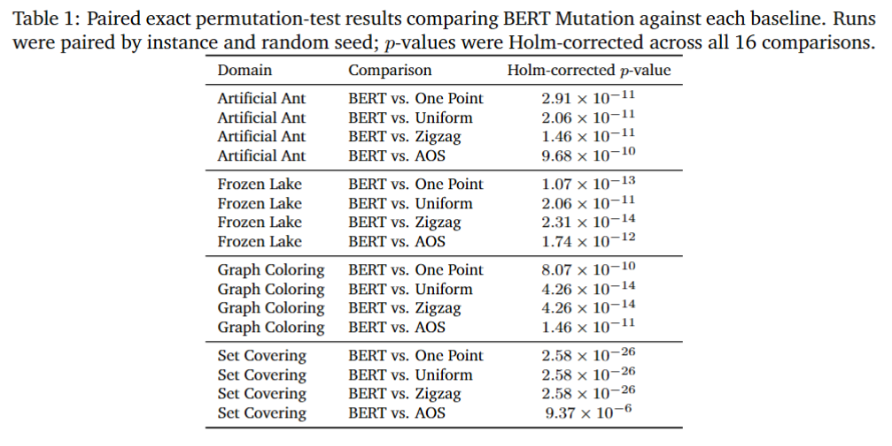

# BERT Mutation for Genetic Algorithms

## Overview

This repository implements the paper `BERT Mutation: Deep Transformer Model for Masked Uniform Mutation in Genetic Algorithms`.

The paper proposes a domain-independent mutation operator for genetic algorithms that uses a BERT-style masked model to predict beneficial gene replacements from context. To make this work for fixed-length GA representations, it adds an elite-guided data augmentation mechanism that creates additional learning signal from strong historical solutions.

In the paper, the method is evaluated on four domains: Frozen Lake, Artificial Ant, Graph Coloring, and Unweighted Set Cover. The reported results show faster convergence and better final fitness than standard mutation baselines and an adaptive operator-selection baseline, while maintaining meaningful population diversity.

## Results from the paper

### Fitness by generation

The following figure presents representative best-individual fitness curves for BERT Mutation and the mutation baselines across the four evaluated domains.


*Best-individual fitness by generation, averaged over 10 runs. Black dots mark the runtime cutoffs.*

### Statistical comparisons

The following table presents the paired exact permutation-test results comparing BERT Mutation against each baseline in every evaluated domain.



*Holm-corrected p-values for comparisons between BERT Mutation and the baseline mutation operators.*

## Benchmark instances

*Benchmark instance sizes used in the experiments. The individual length $L$ denotes the genome length optimized by the GA.*

| Domain | Instance | Problem size | Individual length $L$ |
|---|---|---|---:|
| **Artificial Ant** | | | |
| Artificial Ant | `aux_map1` | $20 \times 20$, 91 food cells | 283 |
| Artificial Ant | `aux_map2` | $20 \times 20$, 69 food cells | 286 |
| Artificial Ant | `john_muir` | $32 \times 32$, 89 food cells | 200 |
| Artificial Ant | `los_altos` | $100 \times 100$, 157 food cells | 800 |
| Artificial Ant | `santafe` | $32 \times 32$, 89 food cells | 400 |
| **Set Covering** | | | |
| Set Covering | `scp41` | 200 rows, 1000 columns | 1000 |
| Set Covering | `scp51` | 200 rows, 2000 columns | 2000 |
| Set Covering | `scp52` | 200 rows, 2000 columns | 2000 |
| Set Covering | `scp53` | 200 rows, 2000 columns | 2000 |
| Set Covering | `scp54` | 200 rows, 2000 columns | 2000 |
| Set Covering | `scp56` | 200 rows, 2000 columns | 2000 |
| Set Covering | `scp57` | 200 rows, 2000 columns | 2000 |
| Set Covering | `scp64` | 200 rows, 1000 columns | 1000 |
| Set Covering | `scp65` | 200 rows, 1000 columns | 1000 |
| **Frozen Lake** | | | |
| Frozen Lake | `default` | $8 \times 8$ grid, 64 states | 64 |
| Frozen Lake | `rand10x10` | $10 \times 10$ grid, 100 states | 100 |
| Frozen Lake | `rand7x7` | $7 \times 7$ grid, 49 states | 49 |
| Frozen Lake | `rand8x8` | $8 \times 8$ grid, 64 states | 64 |
| Frozen Lake | `rand9x9` | $9 \times 9$ grid, 81 states | 81 |
| **Graph Coloring** | | | |
| Graph Coloring | `games120` | 120 vertices, 1276 edges | 120 |
| Graph Coloring | `myciel7` | 191 vertices, 2360 edges | 191 |
| Graph Coloring | `le450_5a` | 450 vertices, 5714 edges | 450 |
| Graph Coloring | `mulsol.i.2` | 188 vertices, 3885 edges | 188 |
| Graph Coloring | `zeroin.i.1` | 211 vertices, 4100 edges | 211 |
| Graph Coloring | `zeroin.i.2` | 211 vertices, 3541 edges | 211 |

## Getting started

### Requirements

- Python 3.9 or newer
- A working PyTorch installation

The code depends on:

- `numpy`
- `gymnasium`
- `torch`
- `transformers`
- `eckity`

### Installation

From the repository root:

```bash
python -m pip install --upgrade pip
python -m pip install -e .
```

## Running the experiments

Artificial Ant:

```bash
python example_runner.py
python -m dnm_paper.experiments.artificial_ant
```

Frozen Lake:

```bash
python example_runner_frozen_lake.py
python -m dnm_paper.experiments.frozen_lake
```

Useful options:

```bash
python -m dnm_paper.experiments.artificial_ant --generations 100 --runs 3 --population-size 6
python -m dnm_paper.experiments.artificial_ant --maps-dir artifical_ant_maps --output-dir experiments/artificial_ant/runs
python -m dnm_paper.experiments.frozen_lake --generations 10 --runs 1 --population-size 100 --total-episodes 2000
```

By default, results are written under `experiments/artificial_ant/runs/<map_name>/bert_mutation/<run_id>/results.json`.
Frozen Lake results are written under `experiments/frozen_lake/runs/<instance_name>/bert_mutation/<run_id>/results.json`.

## Project structure

```text
dnm_paper/
  config.py                    Experiment configuration and default paths
  individuals.py               Custom ECKITY individual creator
  logging_utils.py             JSON statistics logger
  experiments/
    common.py                  Shared experiment helpers and mutation builder
    artificial_ant.py          CLI entry point and experiment orchestration
    frozen_lake.py             CLI entry point and experiment orchestration
  mutation/
    bert.py                    BERT-based mutation operator
    eckity_adapter.py          Adapter that plugs the mutation operator into ECKITY
  problems/
    artificial_ant.py          Artificial ant map loader and evaluator
    frozen_lake.py             Frozen Lake evaluator
    frozen_lake_instances.py   Named Frozen Lake benchmark instances
artifical_ant_maps/            Benchmark map files
pyproject.toml                 Package metadata and dependencies
```
